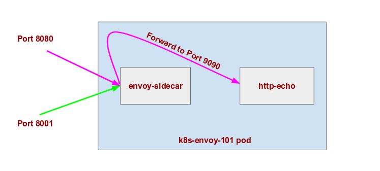

### Envoy in kubernetes

In this session we will deploying application with envoy as sidecar. In this application pod envoy container will be running as the sidecar container to main application container. This envoy sidecar container will be acting as proxy to our application. All the request to and from application will be going via envoy.


- We will create a Kubernetes ConfigMap which will be responsible for mounting envoy configuration in envoy sidecar container.
So lets create a ConfigMap with envoy configuration file `envoy.yaml`
```yaml
apiVersion: v1
kind: ConfigMap
metadata:
  name: envoy-config
data:
  # Adding new entries here will make them appear as files in the deployment.
  # Please update k8s.io/k8s.io/README.md when you update this file
  envoy.yaml: |
    admin:
      access_log_path: "/dev/null"
      address:
        socket_address: { address: 0.0.0.0, port_value: 8001 }
    stats_flush_interval:
      seconds: 5
    static_resources:
      listeners:
      - name: envoy_101_listener_0
        address:
          socket_address: { address: 0.0.0.0, port_value: 8080 }
        filter_chains:
        - filters:
          - name: envoy.http_connection_manager
            config:
              codec_type: HTTP1
              stat_prefix: envoy_101
              server_name: envoy_101
              route_config:
                name: local_app_route
                virtual_hosts:
                - name: local_app
                  domains: ["*"]
                  routes:
                  - match: { prefix: "/" }
                    route: { cluster: local }
              http_filters:
              - name: envoy.router
      clusters:
      - name: local
        type: STATIC
        connect_timeout: 10s
        lb_policy: ROUND_ROBIN
        hosts:
        - socket_address:
            address: 127.0.0.1
            port_value: 9090
            protocol: TCP

```

- Deploy the configmap envoy: 

```command
kubectl apply -f configs/envoy-configmap.yaml
```

- List the configmaps.

```command
 kubectl get cm
```
```
NAME           DATA      AGE
envoy-config   1         6s
```

## K8s Application Deployment.

- Lets create a Kubernetes Deployment and service configuration for our application.

```yaml
apiVersion: apps/v1
kind: Deployment
metadata:
  labels:
    app: flask-app
  name: k8s-envoy-101
  namespace: default
spec:
  replicas: 1
  selector:
    matchLabels:
      app: k8s-envoy-101
  template:
    metadata:
      name: k8s-envoy-101
      labels:
        app: k8s-envoy-101
    spec:
      volumes:
        - name: envoy-config
          configMap:
            name: envoy-config
      containers:
        - name: http-echo
          args: ["-listen", ":9090", "-text", "Hello from main app"]
          image: hashicorp/http-echo:0.2.3
        - name: envoy-sidecar
          image: envoyproxy/envoy-alpine:v1.8.0
          command:
            - "/usr/local/bin/envoy"
          args:
            - "--config-path /etc/envoy/envoy.yaml"
            - "--mode serve"
            - "--service-cluster flask-app"
            - "--v2-config-only"
          ports:
            - containerPort: 8080
              protocol: TCP
              name: app
            - containerPort: 8001
              protocol: TCP
              name: metrics
          volumeMounts:
            - name: envoy-config
              mountPath: /etc/envoy
---
kind: Service
apiVersion: v1
metadata:
  name: k8s-envoy-101
  labels:
    app: k8s-envoy-101
spec:
  type: NodePort
  selector:
    app: k8s-envoy-101
  ports:
  - protocol: TCP
    name: app
    port: 8080
    nodePort: 31009
    targetPort: 8080
  - protocol: TCP
    name: metrics
    port: 8001
    targetPort: 8001
    nodePort: 31010

```


- To run deployment and service of application with envoy as sidecar.

```command
kubectl apply -f configs/app-deployment-with-envoy.yaml
```


All our traffic to come to envoy sidecar then then routed to our http-echo server and we will back response in similar order.

- Open browser and try to access the http://<public-ip>:31009 your request will forwarded to `echo` application and if you try to access the http://<public-ip>:31010 your request will forwarded to `envoy admin configuration`.


