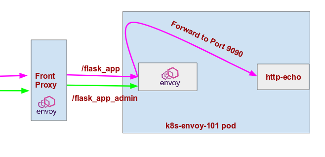

In this session we will demoontrate envoy as front proxy.

We have 2 applications configuration
- First application is front-proxy which will be running with envoy image.
- Second application is A sample flask app running at `9090` port and envoy sidecar running with two port `8080` and `8001`.



All the traffic will go by front-proxy, which is running envoy and depending on url it will be routed to flask app sidecar, the sidecar envoy then will route traffic to flask app.


- Go to 3-Envoy-FrontProxy folder.

```command
cd 3-Envoy-FrontProxy
```

### Let's first create flask application
 

- Let's run the app in kubernetes.

```command
kubectl apply -f configs/app-k8s/configmap.yaml
kubectl apply -f configs/app-k8s/deployment-service.yaml
```


- Let's check if all is running fine or not

```command
kubectl get pods -l  app=envoy-101-front-proxy
```

You can access anything right now, because it's not exposed by service endpoint.


### Now we will create front-proxy to route traffic now

- Let's run front-proxy now.

```command
kubectl apply -f configs/front-proxy/configmap.yaml
kubectl apply -f configs/front-proxy/deployment.yaml
```

- Above config we can see in `configs/front-proxy/configmap.yaml` as below.

```yaml
virtual_hosts:
- name: apps
  domains: [ "*" ]
  routes:
  - match: { prefix: "/flask_app/" }
    route: { prefix_rewrite: "/", cluster: flask_app }
    decorator: { operation: decorator_flask_app }
  - match: { prefix: "/flask_app" }
    route: { prefix_rewrite: "/", cluster: flask_app }
    decorator: { operation: decorator_flask_app }

  - match: { prefix: "/flask_app_admin" }
    route: { cluster: flask_app_admin }
    decorator: { operation: decorator_flask_app_admin }

```


- If we make request with `/flask-app/` it routes to cluster `flask_app`

```yaml
- name: flask_app
    type: STRICT_DNS
    connect_timeout: 10s
    lb_policy: ROUND_ROBIN
    hosts:
    - socket_address: { address: envoy-101-flask-app, port_value: 8080 }
```


### Try to check if flow is working fine or not

```command
curl node-ip:31012/flask_app
curl -I node-ip:31012/flask_app
```

```command
curl node-ip:31012/flask_app/e2
curl -I node-ip:31012/flask_app/e2
```

